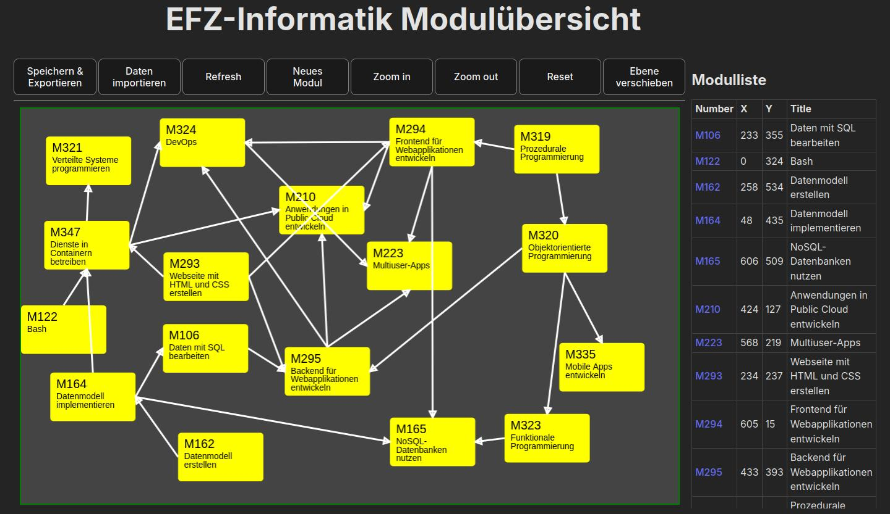

# Visualisierung für ICT-Module und deren Abhängigkeiten

Diese App soll die mannigfaltigen Abhängigkeiten zwischen den Modulen der aktuellen ICT Berufsbildung aufzeigen.

Die Modulnummern in der Modulliste verlinken auf die Modulbeschreibung der ICT-Berufsbildungsseite.

Die Speicherung der Daten findet primär im Browser statt. Erstellte Konfigurationen können via *Speichern & Exportieren* Button lokal abgespeichert und von dort importiert werden.

Das Repo enthält ladbare Daten der BiVo2017. Auf *Daten importieren* klicken, im Repo die Datei *modules_2025-0605.json* auswählen und mit `F5` Seite neu laden.

## Installation

NPM wird vorausgesetzt.

1. Repo clonen
2. im Verzeichnis `npm install` ausführen
3. im Verzeichnis `npm run dev` ausführen
4. Im Browser <http://localhost:5173/> öffnen

# React + Vite

This template provides a minimal setup to get React working in Vite with HMR and some ESLint rules.

Currently, two official plugins are available:

- [@vitejs/plugin-react](https://github.com/vitejs/vite-plugin-react/blob/main/packages/plugin-react/README.md) uses [Babel](https://babeljs.io/) for Fast Refresh
- [@vitejs/plugin-react-swc](https://github.com/vitejs/vite-plugin-react-swc) uses [SWC](https://swc.rs/) for Fast Refresh
